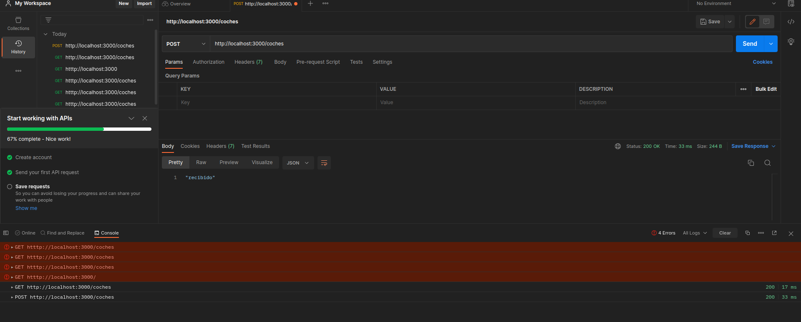
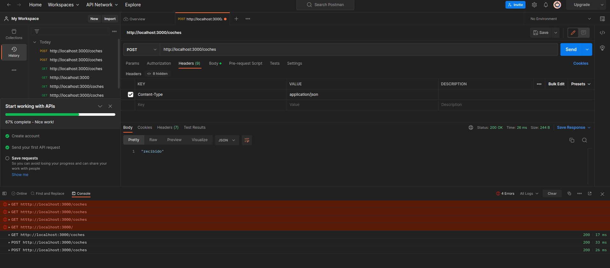

- [MEAN](#mean)
- [Ejecucion de la practica](#ejecucion-de-la-practica)
  - [Ejecutar con nodemon](#ejecutar-con-nodemon)
  - [Angular](#angular)
    - [ERRORES](#errores)
  - [Navegador](#navegador)
- [Ficheros](#ficheros)
  - [angular](#angular-1)
    - [Componentes](#componentes)
    - [servicios](#servicios)
    - [models](#models)
  - [server](#server)
    - [routes](#routes)
      - [routes.js](#routesjs)
        - [get](#get)
        - [post](#post)
        - [put](#put)
        - [delete](#delete)
    - [database.js](#databasejs)
    - [models](#models-1)
      - [coches.js](#cochesjs)
    - [controllers](#controllers)
      - [controller.js](#controllerjs)
    - [index.js](#indexjs)
  - [package.json](#packagejson)
    - [Scripts](#scripts)
- [npm](#npm)
  - [nodemon](#nodemon)
    - [Opcion -D](#opcion--d)
  - [morgan](#morgan)
    - [Que hace](#que-hace)
  - [mongoose](#mongoose)
  - [express](#express)
  - [cors](#cors)
# MEAN
MEAN utiliza las tecnologías de `MongoDB, Express, AngulaJS y NodeJS` para hacer aplicaciones web y lo bueno de todas ellas es que utiliza el mismo lenguaje de programación, `Javascript`. En resumen este tipo de aplicaciones consiste en desarrollar una `API REST` con NodeJS y Express y esta API puede hacer un `CRUD (Create-Read-Upload-Delete)` a la base de datos de MongoDB. Con este API REST se comunicará AngularJS (que es el Frontend) haciendo peticiones (Get, Post, Put y Delete) cuyos datos se tendrán actualizados en la web (Single-Page-Application): 

# Ejecucion de la practica
Para ejecutar la practica primero tendremos que estar seguros de que esta corriendo mongo:
> sudo systemctl status mongod

En caso de que no estea lo iniciamos con start


Por ultimo ejecutamos nuestro servidor:
> node server.js

El cual si todo sale bien deberia aparecer algo como esto

```text
Servidor Express escuchando en el puerto 5000
Conexión a la BaseDatos realizada con exito
express deprecated res.sendfile: Use res.sendFile instead app/routes.js:22:13
```

## Ejecutar con nodemon
Para ejecutar con nodemon primero ver la seccio [nodemon](#nodemon). 

La ejecucion es sencilla solo basta con ejecutar:
> node run dev

## Angular

Para iniciar angular usar:
> ng server -o

El `-op` es para que se abra en el navegador por defecto

### ERRORES
Si te da error es posible que no hayas configurado aun un proyecto de angular con lo cual debes usar el siguiente comando

> ng new angular

`angular` es el nombre que le damos al proyecto

## Navegador
En el navegador podremos comprobar que todo funciona bien si accedemos al enlace [localhost:5000/](localhost:5000/) el cual nos debera mostrar un mensaje de hola mundo

Para acceder a las otras rutas estan especificadas en el fichero routes.js

# Ficheros
Vamos a entender que hacer cada fichero.
Primero que todo tenemos 3 carpetas principales:
- `angular`: contiene el frontend y el fichero html
- [server](#server): que sera donde esta toda la parte del backend
- `node_modules`: que es donde se guardan los modulos que instalamos con npm

Ademas tambien tenemos los .json. Estos ficheros son:
- [package.json](#packagejson) para ver las dependencias que se necesitaran

Por ultimo el fichero `server.js` en el que estará la configuración del servidor

## angular
Aqui vamos a tener todos los ficheros para hacer el frontend con angular.

Para crear todo esto primero y antes que nada tenemos que tener instalado `angular/cli` de esta manera:
> npm -g install angular/cli

Para comprbar que esta instalado de manera correcta hacemos un 
> npm -g ls

Y debera aparecer todos los paquetes que tienes instalado a nivel gloval en tu so y entre ellos debe aparacer `angular/clip`

`Para crear el proyecto`
Desde la carpeta principal hacemos un:
> ng new angular
Donde aquí angular es el nombre del proyecto que vamos a crear

### Componentes
Los componentes los guardaremos en la carpeta components que esta en src/app/
Y los crearemos de esta manera
>ng generate component coches
O de manera simplificada así:
>ng g c coches

### servicios
Para crear los ficheros de servicios iremos a la carpeta de services en el directorio src/app/
Ejecutamos:
> ng g s coche

Los servicios me permiten definir metodos que pueden ser usados en cualquier parte de mi aplicacion

### models
Para crear los ficheros de models iremos a la carpeta de models en el directorio src/app/
Ejecutamos:
> ng g class coche

## server
Aqui estaran todos los fichero del backend es decir el programa que se encargara de la logica de la aplicación

Tenemos varios ficheros y carpetas
- controllers
- [models](#models)
  - [coches.js](#cochesjs)
- routes
  - [routes.js](#routesjs)
- [database.js](#databasejs)
- [index.js](#indexjs)


### routes
En esta carpeta vamos a guardar los ficheros de configuracion para las rutas.
#### routes.js
En este fichero vamos a configurar las rutas.
Tenemos 4 metodos importantes.
- get
- post
- put
- delete

##### get
Get se usa para cuando quieres obtener algo.
Es decir el cliente quiere obtener alguna respuesta en este caso todos los coches o uno solo.
El cliente envia el id del coche que quiere eliminar.

##### post
Post se usa para cuando el cliente quiere enviar algo.
En este caso lo que envia sera un objeto json que se guardara en la base de datos de mongodb 

##### put
Put lo que hace es actualizar.
En nuestra aplicacion se usara para actualizar coches.

##### delete
Delete se usara para eliminar
El cliente envia el id del coche que quiere eliminar


### database.js

### models
En esta carpeta se van a guardar los esquemas de la base de datos que para este caso solo va a haber uno que sera el de coches

#### coches.js
En este fichero vamos a definir el esquema de datos de coche
Para definirlo usaremos schema de esta manera
```javascript
var coche = new Schema({
    marca:          String,
   
    traccion:{
        type:       String,
        enum:       ['FWD', 'RWD', 'AWD', '4WD', '4x4']
    }
});
```
Si queremos que un dato sea requerido es decir que tenga que estar si o si lo podemos hacer de esta manera
```javascript
var coche = new Schema({
    marca:          {type: String, required: true},
   
    traccion:{
        type:       String,
        enum:       ['FWD', 'RWD', 'AWD', '4WD', '4x4']
    }
});
```
Indicando que el tipo de dato es un "String" y que el dato es requerido.
Despues en angular si detecta que falta nos avisara con un mensaje de error.

Despues por ultimo vamos a pasarlo al modelo de datos de mongoose de esta manera:
```javascript
module.exports = mongoose.model('Coche', coche); 
```
Lo que decimos es que mongodb guarde el modelo como Coche y su esquema será el de la variable coche.
Es decir le decimos a mongodb que los datos que vamos a estar almacenando son coche.

Como vamos a usar este archivo en otras partes de la aplicacion tenemos que exportarlo.

### controllers
En este fichero vamos a definir los controladores para nuesta aplicacion. Como solo vamos a tener uno le llamaremos [controller.js](#controllerjs).


#### controller.js
En este fichero vamos a crear un objeto employers que tendra las funciones para controlar la base de datos.

En las funciones vamos a definir como buscar esos datos en la base de datos mongodb
Tenemos 3 opcioenes:
1. Usar callbacks:
   ```javascript
    Coche.find(function (coches,error){
        
    })
   ```
2. Usar promesas:
   ```javascript
    Coche.find()
        .then()
        .catch()
   ```
3. Usar async await (lo que vamos usar)
    ```javascript
    cochesCtrl.findAllCoches = async (req, res) => {
    const coches = await Coche.find();
    }
   ```
   De tal forma que lo que estamos haciendo es decirle a nuestro codigo que la funcion find va a tomar tiempo por lo tanto cuando lo termines lo guardas en la variable coches.


#### Postman 
`importante` Para comprobar que las cosas funcionan sin usar angular todabia vamos a usar la aplicacion postman que en mi caso la instalare en mi so `ubuntu 22.04`.

Este programa lo usaremos para conprobar la funcion añdir.
En los nabegadores por defecto solo envian gets por lo que si queremos usar otra cosa tendremos que usar angular o javascript este progrtama nos facilita el enviar mensajes de este tipo.

Usando este código de prueba:
```javascript
cochesCtrl.addCoche = async (req,res) => {
    console.log(req.body);
    res.json('recibido');
}
```
Y poniendo esto en el postman:



Nos tendra que aparecer un array vacio en la consola pues no tenemos nada en la base de datos por el momento.


Si queremos `enviar datos`, tenemos que ir a la pestaña de body y dentro de ahi en raw.


y en header



### index.js
Este fichero es el fichero principal y el que se ejecuta.
Aqui tendremos la configuracion de [express](#express) asi como la configuracion del [nodemon](#nodemon)


## package.json

En este fichero se especifican los paquetes que se tienen que usar y su version.
Ademas de cosas como la version del programa que estamos haciendo, el nombre del mismo, algunos scripts y mas.

### Scripts
Nosotros vamos a usar este script para correr la aplicacion usando el paquete [nodemon](#nodemon).

Lo configuraremos de esta manera:
``` json
"scripts": {
    "dev": "nodemon server/index.js"
  },
```
Para ejecutar ver [ejecutar con nodemon](#ejecutar-con-nodemon)


# npm
npm es un gestor de paquetes para node.js. Nosotros lo usaremos para instalar 
- [mongoose](#mongoose): Una extension para conectar mongo con node
- [express](#express): Proporciona mecanismos de escritura de manejadores de peticiones con diferentes verbos HTTP en diferentes caminos URL (rutas).
- [nodemon](#nodemon):Sirve para que cada vez que guardemos el fichero se reinicie el servidor solo.
- [angular](#angular):Sirve para crear toda la parte del frontend.
- [morgan](#morgan): sirve para depuerar
- [cors](#cors): Para que funcione bien el angular

## nodemon
Instalar:
> npm install nodemon -D

Este solo nos ayudara a que cuando guardemos los cambios el servidor se reiniciara solo.

### Opcion -D
Esta opcion se usa porque el paquete no es una dependencia sino que es un paquete para ayudar al desarollo. Por eso se usa el -D (developer).

Esto se puede encontrar en el paquete [package.json](#packagejson) de esta manera:

```json
  "devDependencies": {
    "nodemon": "^2.0.21"
  }
```

## morgan
Para instalar morgan:
> npm install morgan

Este se llamara desde el fichero [index.js]

### Que hace
Nos va a ir mostran los mensajes que reciva de esta manera
```bash
GET / 404 3.568 ms - 139
```
- peticion GET
- A la ruta raiz => /
- Con un codigo de mensaje 404
- En un tiempo de 3.568 ms
- El peso de la respuesta es de 139bytes


## mongoose
mongoose se usa para conectar la base de datos de mongodb con node.js
Esto se hace en el fichero 

## express
Para instalar express se usa:
> npm install express --save

Proporciona mecanismos de escritura de manejadores de peticiones con diferentes verbos HTTP en diferentes caminos URL (rutas).

## cors
Necesitamos instalarlo:
> npm install cors
> 
cors lo que hace es hacer de midleware y nos permite hacer que angular funcione bien con nuestro servidor.


lo ponemos asi:
```javascript
const cors = require('cors');
app.use(cors({ origin:'http://localhost:4200'}));
```

